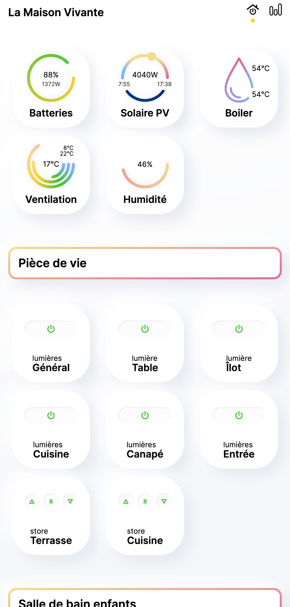
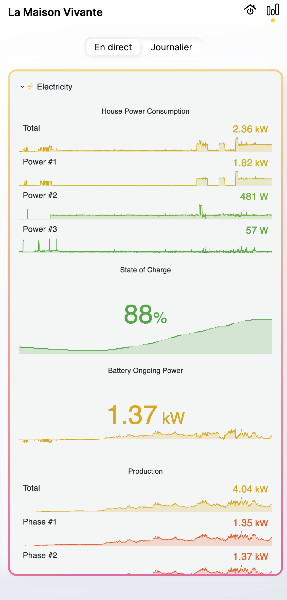
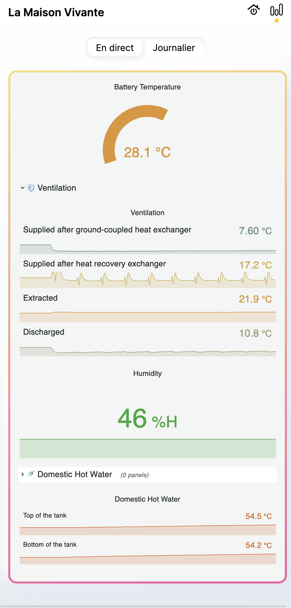
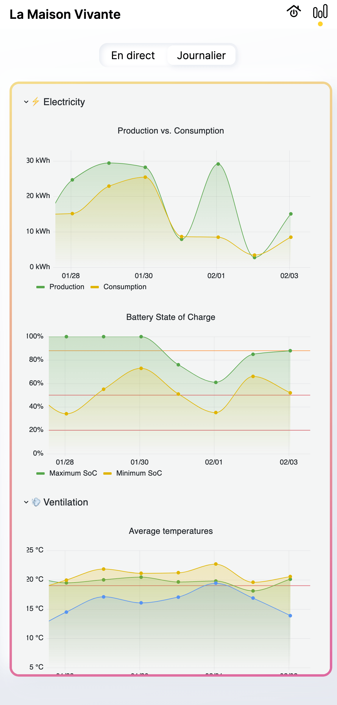

# Home Automation programs for [_La Maison Vivante_](https://lamaisonvivante.blog/)

Some programs used to automate our house. The house is entirely
self-sufficient, which means it is out-of-grid for water and
electricity. There is also no central heating system. And for the most
curious of you, dear readers, the house is made of straw, wood, and
earth, while being super modern! But this repository is about programs
that are used for the home automation, monitoring etc.

# Navigation

## 🪟 Blinds

Blinds are controlled by the `blinds.ino` program, that lands in a
Controllino, along with its companion `blinds`. [Learn more](blinds/).

## 🚿 Domestic Hot Water and 🌬️ Ventilation

Supplied air, extracted air, temperatures, CO<sub>2</sub>, Domestic
Hot Water (DHW), Storage Hot Water (SHW) etc. are monitored with the
`nilan` program. [Learn more](dhw-ventilation/nilan/).

## ⚡ Electricity

Batteries, PV inverter, and house are monitored with the
`victron-reader` program. [Learn more](electricity/victron-reader/).

## 💡 Lights

Lights are controlled by the `lights.ino` program, that lands in a
Controllino, along with its companion `lights`. [Learn more](lights/).

## 💧 Water tanks

The house uses rain for everything. Rain is collected inside 2 water
tanks. The `tanks` program runs in an ESP to calculate the remaining
water in the tanks. [Learn more](tanks/).

## Transport

The transport is composed of two parts: The (electric) vehicle itself,
and its charging station:

### 🚗 Electric vehicle

The electric vehicle is a Kia EV6, it has its own program to fetch
vehicle data via Kia Connect. [Learn more](transport/kia/).

### 🔌 Charging station

The charging station is an Alfen Eve Single S-line, it has its own
program to fetch and to control it. [Learn more](transport/alfen/).

## 🌤️ Weather

Weather can be requested through the `weather` program. It collects
and exposes a set of interesting weather data. [Learn more](weather/).

## Domestic Appliances

Domestic Appliances are used for thiner monitoring. For the moment,
only the dishwasher is supported with the `vzug-reader`
program. [Learn more](appliances/dishwasher/vzug-reader/).

## 🎨 Hub

The hub contains several programs:

### The UI

The UI is a Web application that can be installed natively or run in a
browser. It can be understood as a WebThing gateway. It provides a
nice real-time overview of several WebThings, like the battery, the
solar PV, the ventilation, the domestic hot water, the humidity
etc. It also adds actions to control several things, like the lights
and the blinds. [Learn more](hub/ui/).

<table>
  <thead>
   <tr>
    <th>Home</th>
    <th colspan="2">Realtime Metrics</th>
    <th>Daily Metrics</th>
   </tr>
  </thead>
  <tbody>
   <tr valign="top">
    <td></td>
    <td></td>
    <td></td>
    <td></td>
   </tr>
  </tbody>
</table>

### 💾 The Database

The Database is based on [PostgreSQL](https://www.postgresql.org/) +
[Timescale](https://www.timescale.com/). It contains time-series of
the data fetched by the WebThings. It provides metrics, and can be
used to automate some parts of the house. [Learn more](hub/database/).

The Database is filled by the Event Aggregator.

### The Event Aggregator

The Event Aggregator is a very simple program that fetches data from
various WebThings, and saves them in the Database. That's it! [Learn
more](hub/event-aggregator).

### The Event Automator

The Event Automator is an attempt to automate certain actions in the
house, by looking at the data in the Database to _trigger_ some
WebThing'_actions_. [Learn more](hub/event-automator/).

## 🐧 Services

The `services/` directory contains all service definitions ready to be
consumed by `systemctl`. [Learn more](services/).

# Install

To compile all Rust programs (readers or controllers), run the
following:

```sh
$ cargo build --release --workspace
```

The other `.ino` programs must be installed manually for the
moment. Check respective `README.md`s.

# License

The license is [WTFPL](https://en.wikipedia.org/wiki/WTFPL).

```
       DO WHAT THE FUCK YOU WANT TO PUBLIC LICENSE
                Version 2, December 2004

Copyright (C) 2021- Ivan Enderlin <ivan@mnt.io>

Everyone is permitted to copy and distribute verbatim or modified
copies of this license document, and changing it is allowed as long
as the name is changed.

           DO WHAT THE FUCK YOU WANT TO PUBLIC LICENSE
  TERMS AND CONDITIONS FOR COPYING, DISTRIBUTION AND MODIFICATION

 0. You just DO WHAT THE FUCK YOU WANT TO.
```
