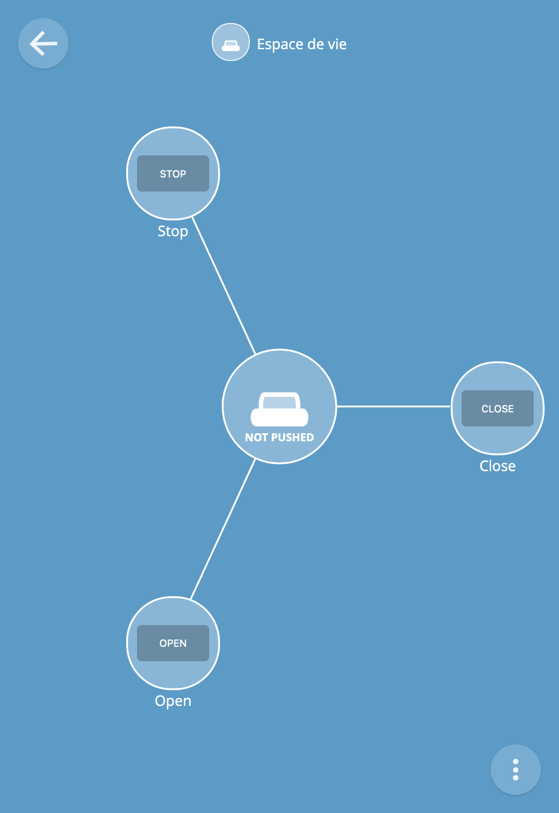

# Blinds Controller

This program aims at controlling the blinds in our house, by talking
to the `blinds.ino` program that lands in a Controllino. To learn more
about how it works, see [the parent documentation](../).

## Installation

This program is written in [Rust](https://www.rust-lang.org/). Just
clone the program, and run:

```sh
$ cargo build --release
```

The executable binary is located in
`./target/release/blinds-controller`.

## Usage

Use `-h`/`--help` to get help:

```
blinds-controller 0.1.0

USAGE:
    blinds-controller [FLAGS] [OPTIONS]

FLAGS:
    -h, --help                 Prints help information
    -t, --into-thing           Turns this program into a Thing, i.e. a new Web of Things device
    -c, --print-config-path    Prints the configuration path and exit
    -V, --version              Prints version information

OPTIONS:
    -x, --action <action>            Type of signal/event to send on the blind [default: Opening]  [possible values:
                                     Unmoving, MovingUp, MovingDown, Opening, Closing]
    -a, --address <address>          Address of the Controllino; see `blinds.ino` to see the port; e.g.
                                     `192.168.1.42:23`. This option overwrites the value read from the configuration
                                     file
    -s, --subject <subject>          Blind to control [default: LivingRoom]  [possible values: Kitchen, LivingRoom,
                                     ParentBedroom, EliBedroom, LouiseBedroom, Bathroom]
    -p, --thing-port <thing-port>    Port of the Thing. Requires `--into-thing` to be effective. This option overwrites
                                     the value read from the configuration file
```

Use the `--address` option to specify the address, and the `--subject`
option to specify the blind to control. The `--action` option defaults
to `Opening`.

A configuration file can be used to read the value of the `--address`
option. Use `--print-config-path` to get the path to the configuration
file.

## Example

### Basic usage

To close the living room blind:

```sh
$ ./target/release/blinds-controller -a 192.168.1.42:23 -s livingroom -x closing
Sending a Closing to LivingRoom…
```

### [Web of Things](https://www.w3.org/WoT/)

To turn all the blinds into standardized connected things, use the
`--into-thing` option: It will start a local Things server. The
`--thing-port` is useful to set the server's port.

Once the Things server is running, use a gateway like the [WebThings
Gateway](https://iot.mozilla.org/gateway/) to interact with the
blinds. Enjoy!

```sh
$ ./target/release/blinds-controller --address 192.168.1.42:23 --into-thing --thing-port 8085
Starting the Things server (port 8085)…
```

Here is how it displays in the WebThings Gateway once registered:


