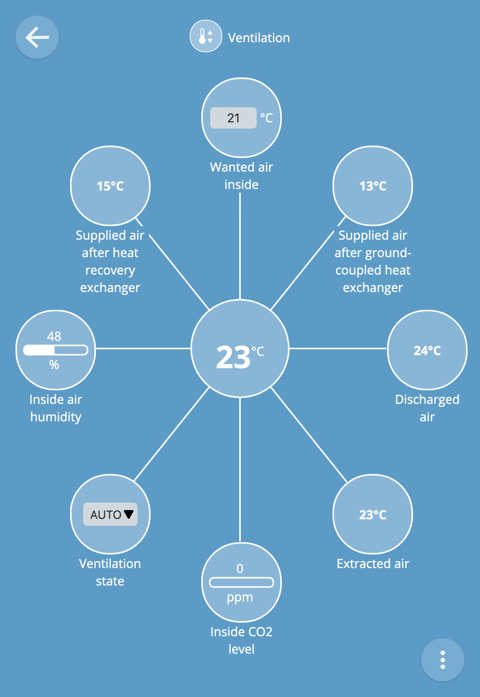
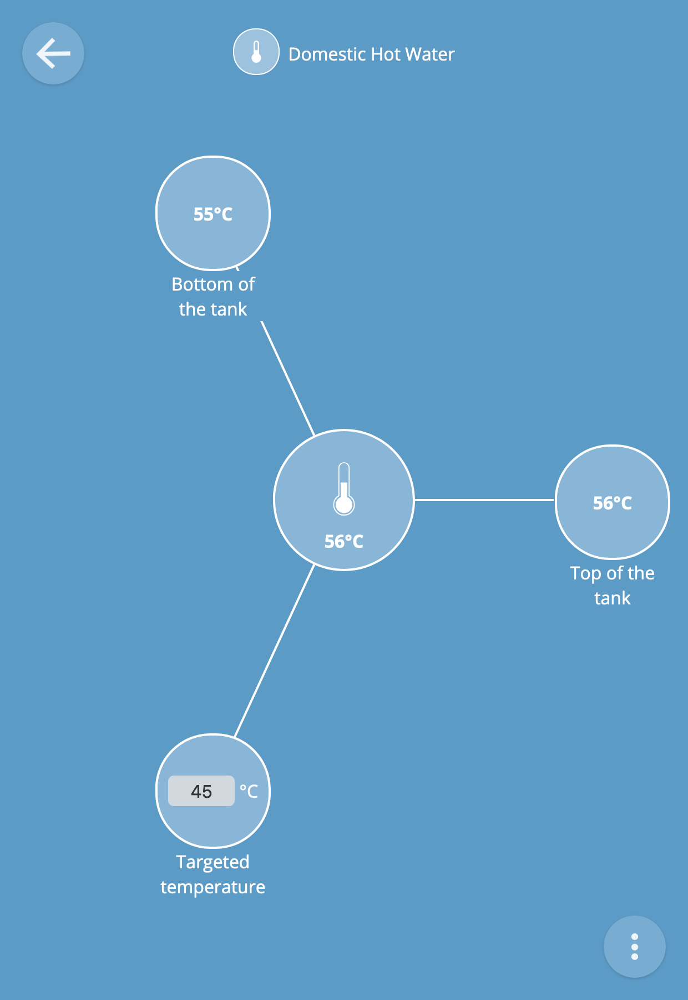

# Nilan

This program aims at reading or writing information from a [Nilan
Compact P
XL](https://en.nilan.dk/en-gb/frontpage/solutions/domestic-solutions/compact-solutions/compact-p-xl-cts700). This
device manages the ventilation, temperatures, CO<sub>2</sub>, Domestic
Hot Water (DHW), Storage Hot Water (SHW, i.e. hot water tank).

> It recovers the energy from the extracted air using a highly
> efficient counter flow heat exchanger. The remaining energy that is
> not utilized by the counter flow heat exchanger is used by the heat
> pump to produce hot water, and to further heat the supply air.
> 
> The heat pump has a reversible cooling circuit, which means that, in
> the summer, the unit can cool the supply air by up to 10 °C. Due to
> the low air exchange, the cooling does not function as an air
> conditioning system. On cooling, the supply air is dehumidified
> which gives a more pleasant indoor climate than is possible with an
> ordinary ventilation unit without a heat pump.

Data are read or written through [Modbus
TCP](https://en.wikipedia.org/wiki/Modbus). An IP address is then
required to reach the Nilan. The port 502 must be opened.

## Understanding our _in situ_ setup

Air and Hot Water are tidily coupled in our house.

Supplied air first goes through a [ground-coupled heat
exchanger](https://en.wikipedia.org/wiki/Ground-coupled_heat_exchanger). We
don't have an outdoor temperature sensor for the moment. Then air goes
inside a [heat-recovery
exchanger](https://en.wikipedia.org/wiki/Heat_recovery_ventilation). Inside
the house, air can be heated by the integrated-green house if
necessary.

Then air is extracted, and goes through the heat-recovery exchanger
again (obviously). Extra joules are transferred to hot water. Extra
extra joules are used to further heat the supplied air if necessary.

Domestic Hot Water is mainly heated by air. But it can also be heated
by an electrical resistance for fast heating.

## Installation

The program is written in [Rust](https://www.rust-lang.org/). Just
clone the program, and run:

```shell
$ cargo build --release
```

The executable binary is located in `/target/release/nilan`.

## Usage

Use `-h`/`--help` to get help:

```
nilan 0.3.0
This command allows to read values, or write new values to a Nilan Compact P XL device

USAGE:
    nilan [FLAGS] [OPTIONS] <SUBCOMMAND>

FLAGS:
    -h, --help                 Prints help information
    -c, --print-config-path    Print the configuration path and exit
    -V, --version              Prints version information

OPTIONS:
    -a, --address <address>    Modbus address of the Nilan, e.g. `192.168.1.142:502`. This option overwrites the value
                               read from the configuration file

SUBCOMMANDS:
    help     Prints this message or the help of the given subcommand(s)
    read     Read values from the Nilan
    write    Write values to the Nilan
```

Use the `read` or `write` subcommands to do something useful. Use the
`--address` option to specify the address.

A configuration file can be used to read the value of the `--address`
option. Use `--print-config-path` to get the path to the configuration
file.

Let's see `nilan read --help`:

```
nilan-read 0.3.0
Read values from the Nilan

USAGE:
    nilan read [FLAGS] [OPTIONS]

FLAGS:
    -h, --help          Prints help information
    -t, --into-thing    Turns this program into a Thing, i.e. a new Web of Things device
    -V, --version       Prints version information

OPTIONS:
    -f, --format <format>            Define the kind of outputs [default: Text]  [possible values: Text, Json]
    -p, --thing-port <thing-port>    Port of the Thing. Requires `--into-thing` to be effective. This option overwrites
                                     the value read from the configuration file
```

And let's see `nilan write --help`:

```
nilan-write 0.3.0
Write values to the Nilan

USAGE:
    nilan write [FLAGS]

FLAGS:
    -h, --help                  Prints help information
    -w, --toggle-hot-water      Toggle boiling hot water by playing with the anti-legionna program
    -v, --toggle-ventilation    Toggle the ventilation
    -V, --version               Prints version information
```

### Format

The `nilan read` tool is designed to work in multiple environments.

#### Text

By default, the text format is selected.

```text
State {
    ventilation: Ventilation {
        state: Auto,
        air_throughput: AirThroughput {
            supplied_air_fan_speed: Rpm(
                25.0,
            ),
            extracted_air_fan_speed: Rpm(
                27.0,
            ),
        },
        inside_air_humidity: Percent(
            38.0,
        ),
        inside_co2_level: Ppm(
            0.0,
        ),
        temperatures: AirTemperatures {
            supplied_air_after_ground_coupled_heat_exchanger: Degree(
                13.0,
            ),
            supplied_air_after_heat_recovery_exchanger: Degree(
                20.0,
            ),
            extracted_air: Degree(
                22.4,
            ),
            discharged_air: Degree(
                12.8,
            ),
            wanted_inside_air: Degree(
                21.0,
            ),
        },
    },
    domestic_hot_water: DomesticHotWater {
        anti_legionella: AntiLegionella {
            frequency: Weekly,
            day: 1,
            hour: 10,
        },
        storage_temperatures: StorageHotWaterTemperatures {
            top_of_the_tank: Degree(
                57.0,
            ),
            bottom_of_the_tank: Degree(
                53.4,
            ),
            wanted: Degree(
                45.0,
            ),
        },
    },
}
```

#### [JSON](https://www.json.org/json-en.html)

JSON can be used in a Web environment. Example with `nilan read --address
<addr> --format json` (formatted with `… | python -m json.tool`):

```json
{
    "ventilation": {
        "state": "Auto",
        "air_throughput": {
            "supplied_air_fan_speed": 25.0,
            "extracted_air_fan_speed": 27.0
        },
        "inside_air_humidity": 38.0,
        "inside_co2_level": 0.0,
        "temperatures": {
            "supplied_air_after_ground_coupled_heat_exchanger": 13.0,
            "supplied_air_after_heat_recovery_exchanger": 20.0,
            "extracted_air": 22.4,
            "discharged_air": 12.8,
            "wanted_inside_air": 21.0
        }
    },
    "domestic_hot_water": {
        "anti_legionella": {
            "frequency": "Weekly",
            "day": 1,
            "hour": 10
        },
        "storage_temperatures": {
            "top_of_the_tank": 57.0,
            "bottom_of_the_tank": 53.4,
            "wanted": 45.0
        }
    }
}
```

### [Web of Things](https://www.w3.org/WoT/)

To turn the Nilan device into standardized connected things, use the
`--into-thing` option: It will start a local Things server. The
`--thing-port` is useful to set the server's port.

Once the Things server is running, use a gateway like the [WebThings
Gateway](https://iot.mozilla.org/gateway/) to interact with the Nilan
device. Enjoy!

```sh
$ /target/release/nilan read --address 192.168.1.122:502 --into-thing --thing-port 8083
Starting the Things server (port 8083)…
```

Here is how it displays in the WebThings Gateway once registered:



