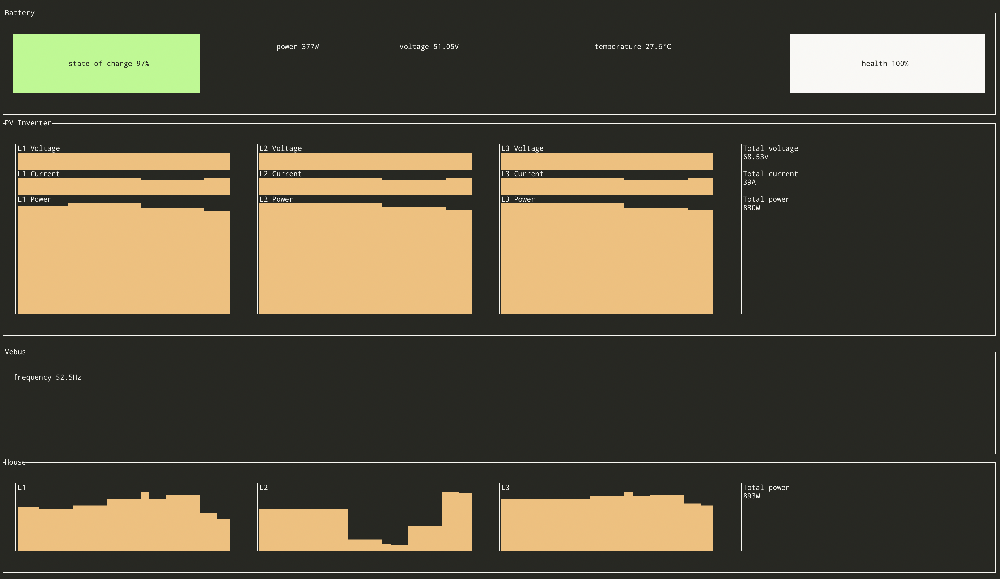

# Victron Reader

This program aims at reading information from a [Victron
CCGX](https://www.victronenergy.com/panel-systems-remote-monitoring/color-control)
device. In our house, this device is connected to the batteries, the
PV inverter, and the house (which includes the charging/discharging
station for the electric vehicle).

Data are read through [Modbus
TCP](https://en.wikipedia.org/wiki/Modbus). An IP address is then
required to reach the Victron CCGX. The port 502 must be opened.

## Installation

The program is written in [Rust](https://www.rust-lang.org/). Just
clone the program, and run:

```shell
$ cargo build --release
```

The executable binary is located in `/target/release/victron-reader`.

## Usage

Use `-h`/`--help` to get help:

```
victron-reader 0.3.0

USAGE:
    victron-reader [FLAGS] [OPTIONS]

FLAGS:
    -h, --help                 Prints help information
    -t, --into-thing           Turns this program into a Thing, i.e. a new Web of Things device
    -c, --print-config-path    Print the configuration path and exit
    -V, --version              Prints version information

OPTIONS:
    -a, --address <address>          Modbus address of the Victron CCGX, e.g. `192.168.1.142:502`. This option
                                     overwrites the value read from the configuration file
    -f, --format <format>            Define the kind of outputs [default: Text]  [possible values: Text, Json, Tui]
    -p, --thing-port <thing-port>    Port of the Thing. Requires `--into-thing` to be effective. This option overwrites
                                     the value read from the configuration file
```

Use the `--address` option to specify the address. That's the only thing
you need to know!

A configuration file can be used to read the value of the `--address`
option. Use `--print-config-path` to get the path to the configuration
file.

### Format

The `victron-reader` tool is designed to work in multiple
environments.

#### Text

By default, the text format is selected.

```text
Battery {
    state: idle,
    state of charge: 97%,
    ongoing power: 0W,
    voltage: 51.04V,
    temperature: 27.2°C,
    health: 100%,
}

PvInverter {
    L1 voltage: 22.86V,
    L1 current: 7A,
    L1 power: 151W,
    L2 voltage: 22.85V,
    L2 current: 7A,
    L2 power: 155W,
    L3 voltage: 22.84V,
    L3 current: 6A,
    L3 power: 142W,
    total power: 448W,
}

Vebus {
    frequency: 52.64Hz
}

House {
    l1: 110W
    l2: 74W
    l3: 111W
    total consumption: 295W
}
```

#### [JSON](https://www.json.org/json-en.html)

JSON can be used in a Web environment. Example with `victron-reader
--address <addr> --format json` (formatted with `… | python -m
json.tool`):

```json
{
    "battery": {
        "state": "Charging",
        "state_of_charge": 97.0,
        "ongoing_power": 40.0,
        "voltage": 51.02,
        "temperature": 27.2,
        "health": 100.0
    },
    "pv_inverter": {
        "l1": {
            "voltage": 22.87,
            "current": 14.0,
            "power": 322.0
        },
        "l2": {
            "voltage": 22.83,
            "current": 14.0,
            "power": 331.0
        },
        "l3": {
            "voltage": 22.84,
            "current": 14.0,
            "power": 312.0
        }
    },
    "vebus": {
        "frequency": 52.5
    },
    "house": {
        "l1": 74.0,
        "l2": 572.0,
        "l3": 100.0
    }
}
```

#### TUI

TUI is just the fancy mode to show off with your friends. Example with
`victron-reader --address <addr> --format tui`:



The refresh rate is every 500ms.

### [Web of Things](https://www.w3.org/WoT/)

To turn the Victron device into standardized connected things, use the
`--into-thing` option: It will start a local Things server. The
`--thing-port` is useful to set the server's port.

Once the Things server is running, use a gateway like the [WebThings
Gateway](https://iot.mozilla.org/gateway/) to interact with the Victron
device. Enjoy!

```sh
$ /target/release/victron-reader --address 192.168.1.117:502 --into-thing --thing-port 8082
Starting the Things server (port 8082)…
```

Here is how it displays in the WebThings Gateway once registered:


